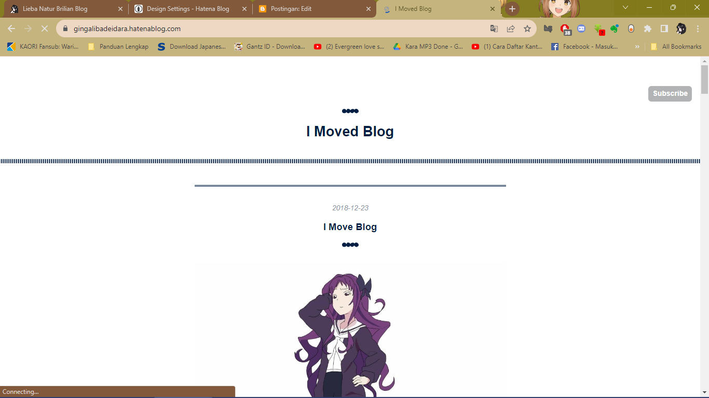
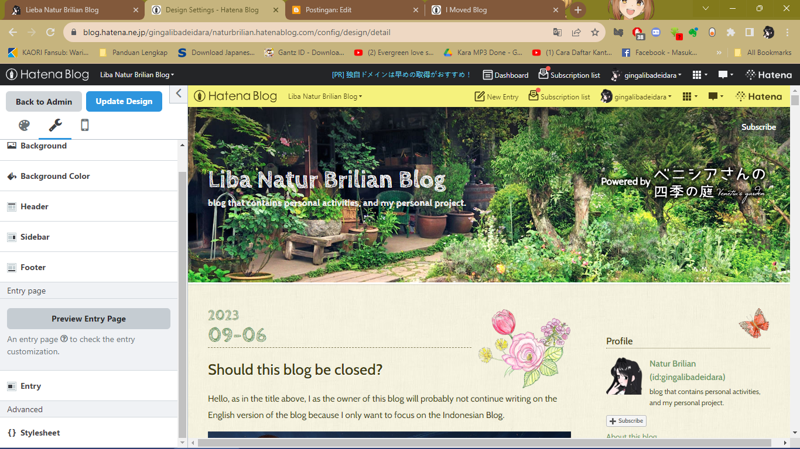

Halo, aku kembali lagi dan kali ini adalah curhatan ane soal platform blogging berbahasa Jepang, yaitu Hatena. Sama seperti blogger atau platform blogging lainnya, awalnya aku menggunakan blog ini untuk blog cabang berbahasa Inggris di tahun 2016, awalnya bernama gingalibadeidara (yaps, itu adalah nama pena ku juga di deviantart) hingga tahun 2023 ini.

# Lalu alasan, mengapa blog ini dihentikan aktivitasnya?
Nah, aku di tahun 2023 terpaksa menghentikan aktifitas bloggingku di tahun ini, dengan alasan berikut:

## 1. Keterbatasan kustomisasi
Yang dimana pengguna platform ini, mau tidak mau harus menggunakan templat blog yang sudah disediakan dan tidak bisa dikustomisasi. Beda dengan blogger yang bisa kamu download templat blognya di blog luar.

## 2. Semakin lama semakin berat
Benar, semakin lama platform blog ini ketika diakses dari perangkat kentang, apalagi laptop ane sendiri makin berat & untuk memuat halaman saja lambat, namun di hp tidak karena dia tampilannya sangat sederhana.

## 3. Berbayar apalagi untuk kustom domain
Yaps, salah satu faktor yang gak bikin ane nyaman disini yaitu berbayar, apalagi biayanya juga lebih mahal dan kustom domain juga belum tentu mendukung domain my.id
Nah, ini semua adalah murni pendapat pribadi dariku, semua itu balik ke keputusan masing-masing, kamu ingin ngeblog di platform manapun itu terserah kalian ehehe.