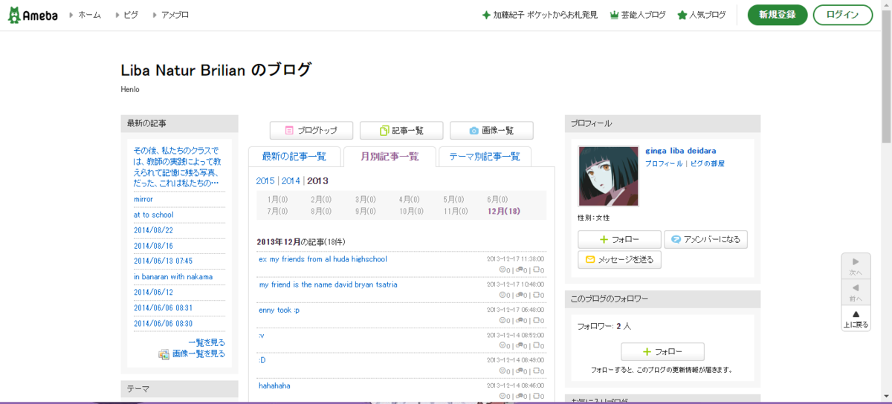
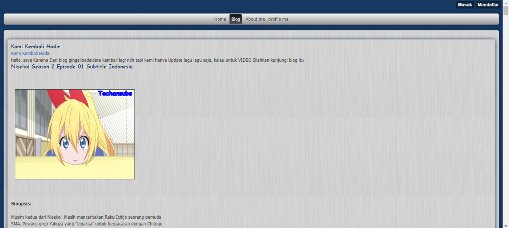
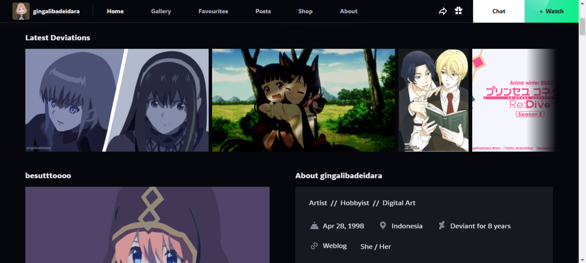
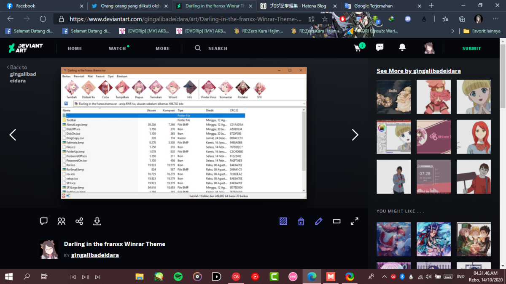
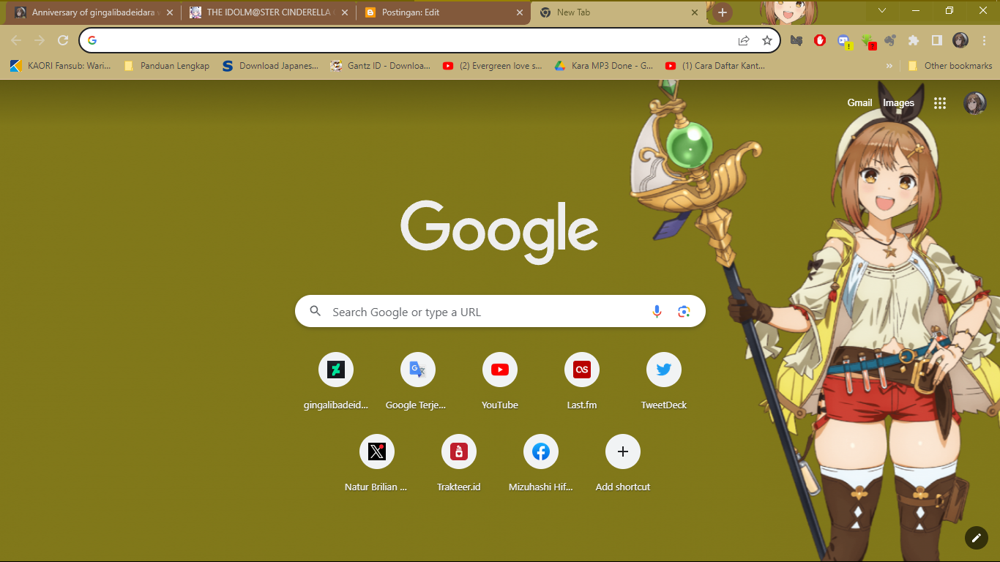
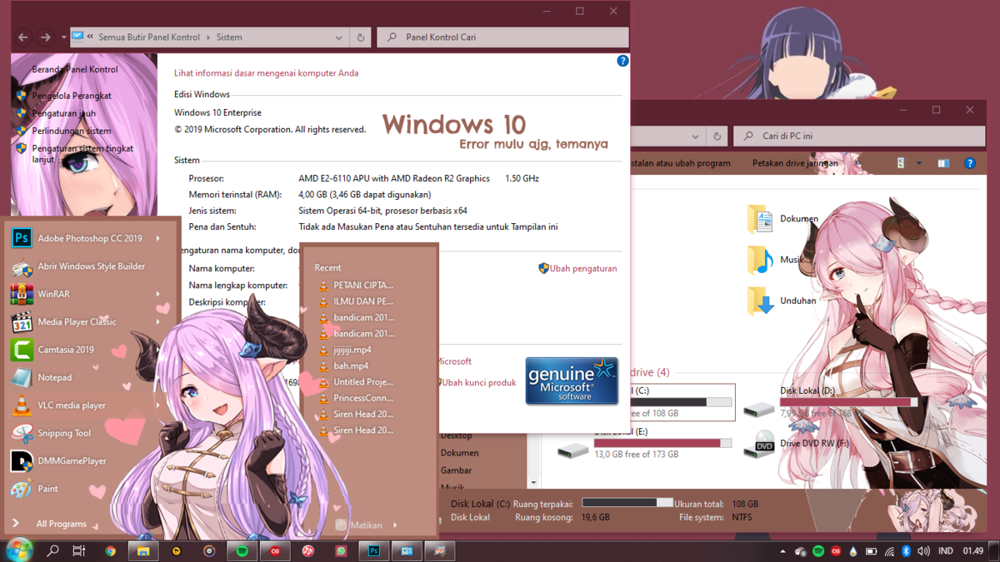
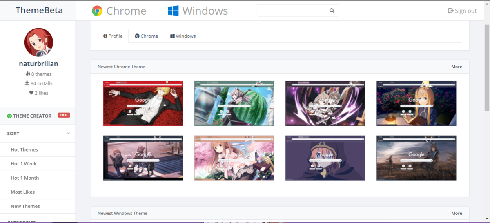
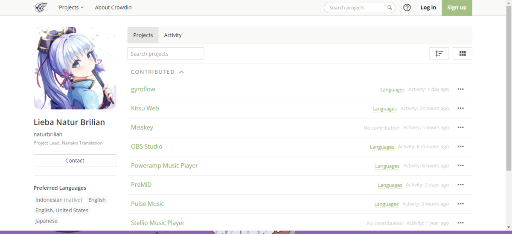

Halo, akhirnya aku kembali kesini. Seperti judul yang ada diatas, saya akan memberi tahu asal-muasal proyek ini berdiri seperti apa. Sebenarnya awal mula proyek ini bermula ketika saya tertarik dengan dunia blogging di tahun 2013, kala itu saya masih ada di bangku SMP.

# - BLOGGING #

Platform blog pertama kali yang saya gunakan untuk memulai blogging itu adalah Ameblo JP, platform blogging dalam bahasa Jepang, jadi pertama kali saya memposting gambar dan kegiatan di sekolah, namun di tahun 2014, saya menyadari kalau saya salah memilih username blog & sampai sekarang ini tidak bisa diganti. Jadi saya memutuskan untuk membuat blog baru dengan nama "Gingalibadeidara". Oh ya saat pertama kali menggunakan blog, saya merasa bingung.. bagaimana caranya posting ke sebuah blog, akhirnya teman saya dulu merekomendasikan mobie in, platform blogging untuk di hp.

# - Deviantart #
Pada waktu itu saya menggunakan platform ini hanya untuk mencari fanART, seperti Naruto dan lain-lainnya, karena untuk mengunduhnya harus memiliki akun & yaps, untuk menyimpan bookmark fanart yang bagus, salah satunya adalah Goriverde pembuat fanart Naruto kesukaan saya. 2016 mulai mengunggah hasil pertama dalam mendesain (baik hasil dari belajar di sekolah dan tutorial), lalu kemudian Line Art hingga seterusnya.

Proyek Vektor dimulai tahun 2019, oh ya sebelumnya aku sempat membuat Line Art dan minimalis menggunakan Paint Tool Sai.

# - Proyek Skin & Tema #
Ini adalah proyek pertama saya, sebenarnya proyek ini sudah dimulai dari 2017.. tetapi itu hanyalah Private Project. Saya memulai membuat tema dimulai dari Tema Winrar, karena menurutku ini adalah paling gampang, lalu kemudian ke Tema peramban seperti Firefox & Chrome.

# - Proyek Terjemahan #

Sebenarnya untuk proyek terjemahan, saya memulai nya tahun 2017, karena waktu itu saya kebetulan tertarik dengan salah satu platform sebut saja "Discord" waktu masih awal-awal "Ingin menerjemahkan layanan ini ke Bahasa anda?" dan ini yang benar-benar saya tertarik waktu itu, dan saya memutuskan untuk bergabung sebagai kontributor, Namun setelah itu mereka menghapusnya (sadly)
Tak terasa proyek ini sudah berumur 8 tahun, dan sekarang tidak tau harus apa. Yang awalnya karena untuk iseng-iseng.
Sekian untuk tulisan berikut ini, have a nice dream.