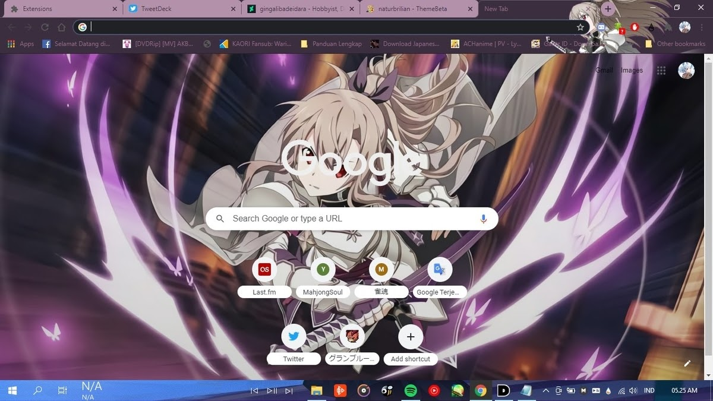

Mungkin seperti judul di artikel ini, apa yang kalian harapkan di tahun 2021, banyak orang berharap ada yang menginginkan perangkat baru untuk keperluan editing, ingin punya jodoh dan lain sebagainya. Oh ya, sama seperti penulis artikel di blog ini & saya juga berharap di tahun depan tidak akan ada masalah yang menimpa saya, seperti peristiwa yang sungguh bodoh bagiku, seperti peretasan akun dan lain sebagainya. Ngomong ngomong ini juga artikel terakhir untuk tahun 2020, sekaligus artikel tambahan, kemarin saya juga sempat untuk membuat tema lain, dari salah satu mobile game tidak lain adalah dari Sword Art Online Alicization dengan karakter Eydis Synthesis.

Kamu bisa mengunduhnya melalui Tautan di bawah ini. Di dalam arsip ada 2 jenis tema yang saya buat silahkan dicoba.
Terima kasih sudah berkunjung ke blog saya, dan saya mengucapkan Selamat Tahun Baru 2021, saya berharap cita citamu tercapai, dan saya berharap bisa melihat Yuanfen debut di tahun baru (Tinggal Ichirou Rei debut Vtuber) ampe sekarang belum debut *lel.

# Tema Eydis Synthesis #
::github{repo="naturbrilian/Chrome-Themes"}
