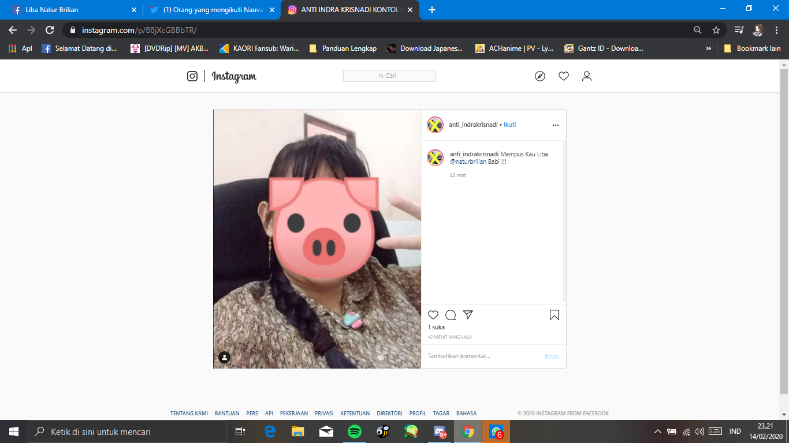
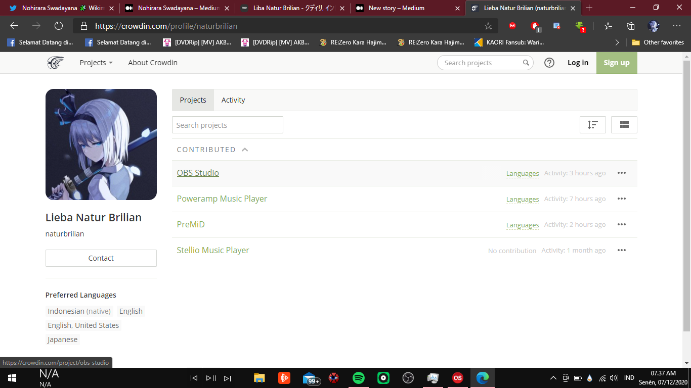

Mungkin beberapa dari kalian sudah mengikuti kegiatan saya mulai dari real life hingga di sosial media, di bulan Januari mungkin belum terjadi apa-apa karena saya lupa ya waktu itu hadeeh, oke lupakan di bulan Januari sampai Februari. Di bulan Februari-Maret saya sempat terkena musibah yang menyebabkan nama saya di cap jelek, sebut saja Anak Berkebutuhan Khusus yang hobinya berhalusinasi. Saya sempat kena imbasnya mulai dikatain kata2 jorok, foto saya di edit jadi babi hingga saya terpaksa menyamar jadi Anak Berkebutuhan Khusus yang menggunakan akun “Anti_blablabla”

Di bulan Maret saya sudah merasa lega untuk itu hingga saat ini, tetapi hal bodoh masih terus menyelimuti otakku, yaitu waktu ada pendaftaran audisi salah satu Virtual Youtuber (VTuber) saya menyebut anak ABK untuk mengikuti audisi terus di sosmed, yang berujung di hapus dari daftarnya (Alhamdullilah), pada bulan Agustus saya mencoba untuk membuat sebuah proyek sendiri yaitu proyek terjemahan sebuah aplikasi dan video, saya mencoba gabung ke sebuah proyek translasi yang bisa kamu lihat di crowdin.

Bulan November hingga saat ini tidak terjadi apa apa, hanya mencoba gim baru bernama Sword Art Online: Alicization Rising Steel dan Princess Connect Re: Dive yang sudah saya mainkan 1 tahun yang lalu. Sekian dari cerita saya untuk saat ini, semoga di tahun 2021 tidak terjadi apa2 dan kedepannya jadi lebih baik.