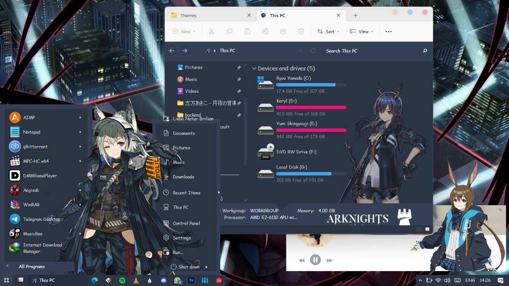
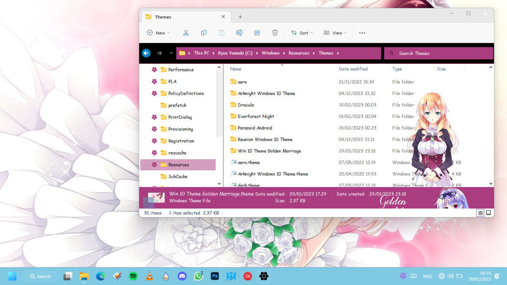
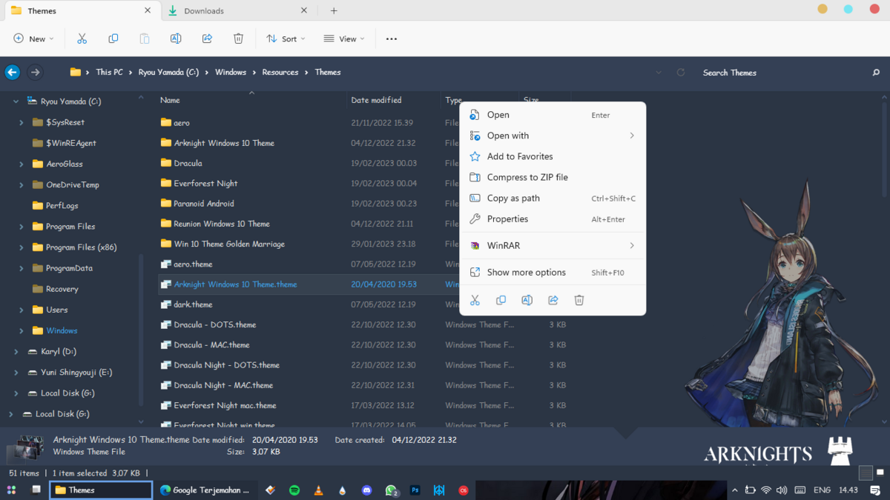
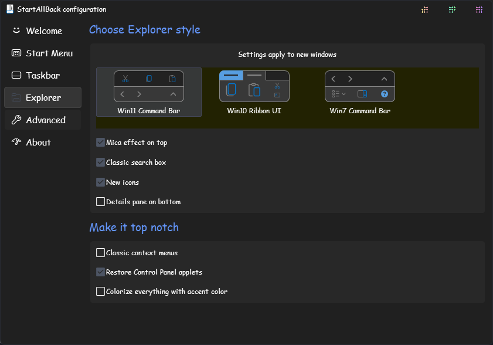

Halo para pengunjung setia, sepertinya saya sudah lama tidak ngeblog disini karena ya satu bingung mau nulis apa dan kesibukan juga. Oh ya mungkin beberapa orang pada bertanya apalagi termasuk di salah satu halaman penggemar bertanya "Apakah tema ini bisa digunakan/diterapkan di os paling tinggi a.k.a Windows 11?" Tentu saja jawabannya bisa, dengan catatan nanti ada beberapa tombol menu konteks bermasalah (karena emang base nya bukan menggunakan w11 tapi w10).
Dulu penulis sudah menguji coba nya menggunakan tema Arknights buatan Desonime dan Golden Marriage buatan ~Theia dan bekerja dengan sempurna, walaupun ada beberapa base yang error

# Bagaimana cara menerapkannya? #
Untuk menerapkan tema ini, kamu harus melalui folder C:\Windows\Resources\Themes lalu Cari Tema Arknight Windows 10 Theme.theme, lalu klik ganda pada tema tersebut. 

# Mengapa saat menerapkan, tidak lewat pengaturan Windows? #
Sebenarnya bisa, hanya saja tema itu tidak akan bisa diterapkan dikarenakan beda base.

# Apa saja kekurangan dari cara ini? #
Kurang lebih seperti yang ada di tangkapan layar ini.

Menu konteks klasik tidak akan bisa muncul, karena masalah kompatibilitas pada tema ini, jadi sebenarnya kamu bisa mengakali hal ini. Bagaimana cara mengatasinya? Atur seperti ini di startallback

# Untuk Patch Themes #
Patch Tema caranya masih sama, jangan lupa untuk membuat titik restore, karena ini sangat penting kalau semisal ada masalah pada sistem operasimu.

# Apakah menerapkan tema ini sangat direkomendasikan? #
Sebenarnya tidak, karena sudah beda sistem operasi. Namun kalau kamu ingin menggunakannya, dipersilahkan dengan catatan harus menanggung resiko (disarankan sebaiknya mencari tema yang sudah kompatibel dengan os ini).

Artikel ini juga tersedia dalam Bahasa Inggris.