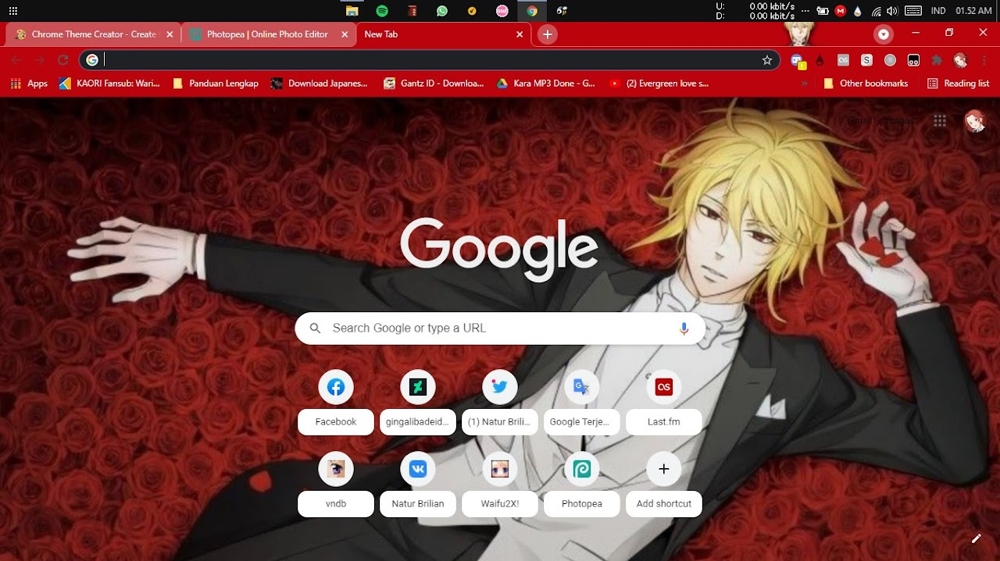
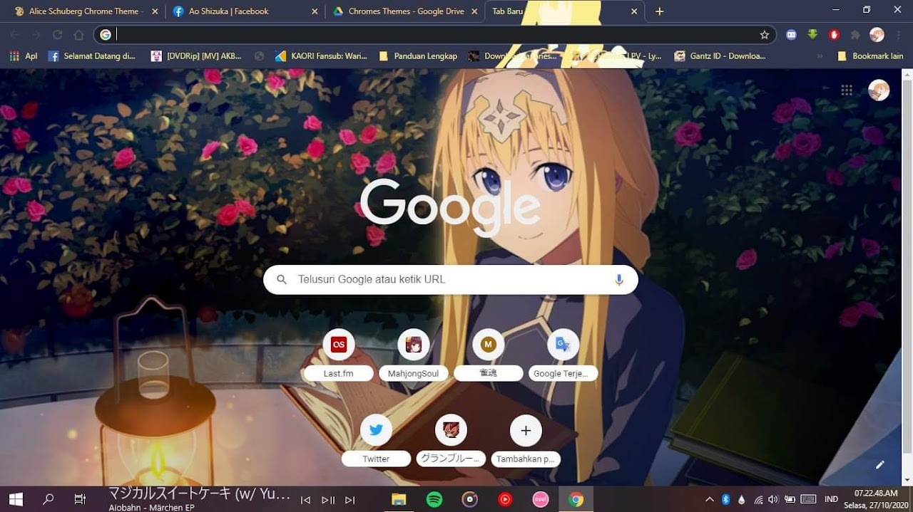

Pada artikel pertama ini, mungkin saja sebut pindahan dari blog lama, yaitu tema browser. Gak asing lagi kan sama yang satu ini. Baru saja kemarin saya membuat tema dari salah satu anime yang saat ini sedang disukai oleh anak anak di twitter bahkan sampai ada autobase nya, ya sebut saja Moriarity the Patriot. Kali ini saya mengambil salah satu karakternya yaitu William James Moriarity.

Ngomong ngomong saat saya mencari gambar untuk bahannya saya sangat kesulitan, karena campur dengan karakter yang aslinya. Dan gambar yang ada di internet bertebaran cuma sedikit.

#Tema Alice Schuberg

Nah, sebelumnya saya juga sempat membuat tema dari salah satu gim sekaligus anime Sword Art Online: Alicization, untuk anime nya sendiri bisa kamu nikmati di situs IQiYI. Mengapa saya memilih Alice Schuberg, kebetulan dia adalah karakter favorit di salah satu gim Alicization Rising Steel. Gambar disamping adalah salah satu tangkapan layarnya. Untuk tautan Unduhannya, akan saya sediakan dibawah

::github{repo="naturbrilian/Chrome-Themes"}

Sekian untuk artikel soal ini, semoga senang dengan tema buatanku ini