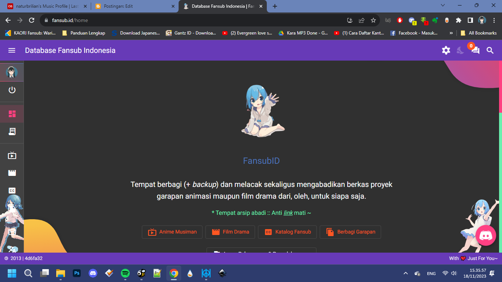
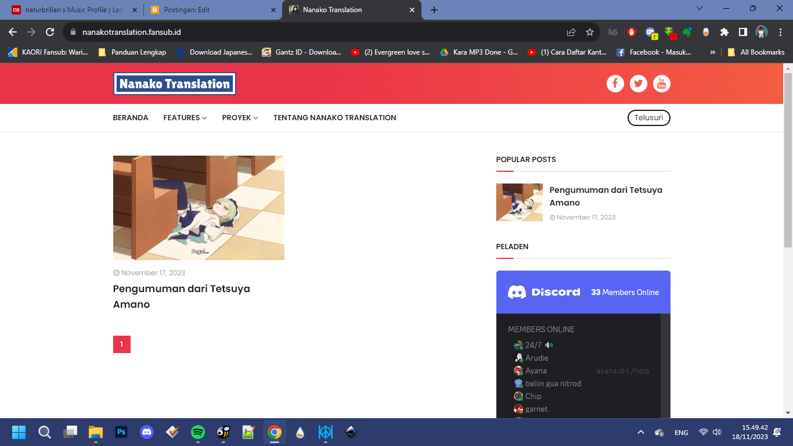
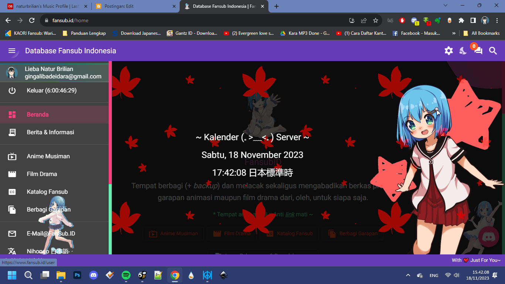
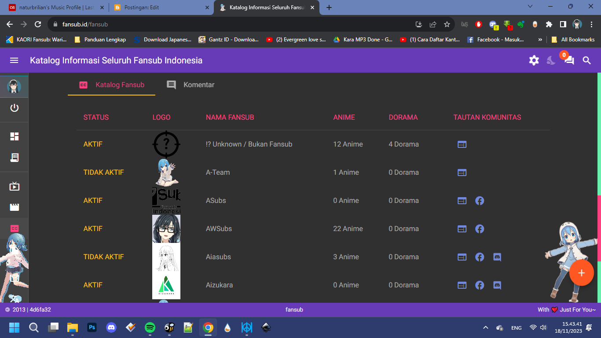

Halo, sepertinya sudah lama tidak menulis lagi disini (perasaan baru saja deh aku nulis wkwkwk). Seperti judulnya, kemarin ane lagi surfing soal domain yang nanti kedepannya nasibnya gimana dan tiba-tiba menemukan sebuah situs web fansubID.

Yak, dari tampilannya sendiri emang agak berat karena efeknya.. namun ini bisa dimatikan seharusnya. Disini ane bukan ngebahas soal situs webnya, melainkan soal domain fansub id yang diberikan secara gratis + kamu juga dapat bonus email (ex: naturbrilian@fansub.id). Nah, untuk sub-domain ini sendiri tak gunakan di Blog Nanako Translation Blog, yang awalnya si Tetsuya ada rencana mau gabung di sub-domain punyaku naturbrilian.my.id tapi dia bingung.

## Cara Klaimnya Bagaimana?
Nah, sebenarnya untuk klaimnya ini gampang banget dan konfigurasinya. Kamu cukup masuk ke menu sidebar kiri itu > katalog fansub, nanti banyak daftar-daftar fansub

Belum memiliki grup unit fansub kamu? tinggal buat dulu dengan menekan tombol tambah di bawah pojok kanan itu. Selanjutnya ikuti intruksi di situs itu, atau melalui pranala berikut. Untuk kotak "tambahkan khusus blogger" (kotak nomer 2) isi dengan alamat blogmu (ex: example.blogspot.com). Jadi ini bisa jadi alternatif kamu kalau semisal terkendala biaya untuk beli domain, bisa numpang disini wkwkwk