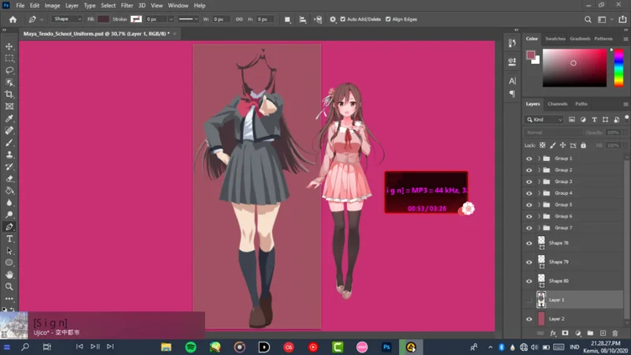
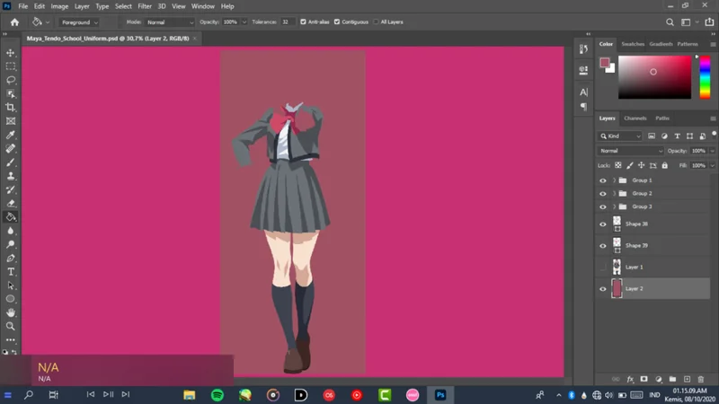

はい、タイトルが示すように。 以前はウェブサイトのページを持っていなかったので、2日前にウェブページを作成しようとしました。おそらくここですでに知っている人もいますが、そのときはツイッターアカウントに投稿しました。

ああ、すみません、ツイートはインドネシア語です。
翻訳する: 昨日はベクトル化を終えていないので、github、teheを試すことに夢中になっていることを知っています （ツイート2）
ウェブデザインを作成するだけです（音楽プレーヤーのような最初のコンセプト...しかし代わりに私は急いでそれを適用したかったです (ツイート1)

そうそう、それに加えて、私はまだ訪問者のリクエストからのベクトルの壁紙とカラオケ効果プロジェクト+インドネシア語の翻訳に取り組んでいます

ウェブサイトのページについては、次のURLからアクセスしてください。それでも、まだ混乱しています。Website
次の記事でお会いしましょう、そしてあなたの健康に気をつけてください

ああ、はい、ベクターは利用可能です、以下のリンクからダウンロードしてください
Tendo Maya

