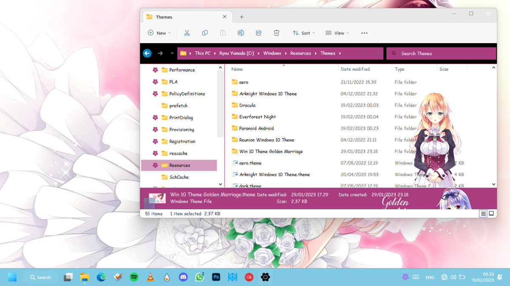
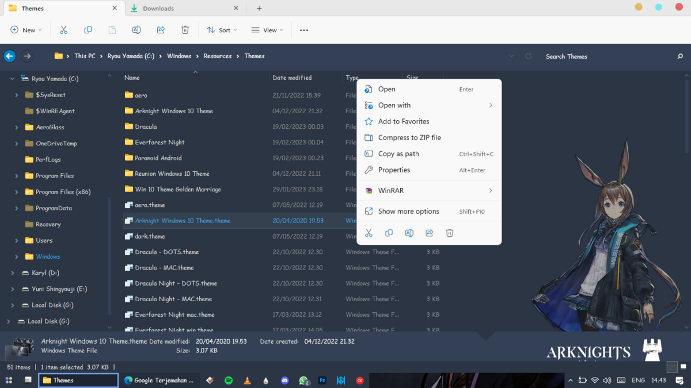
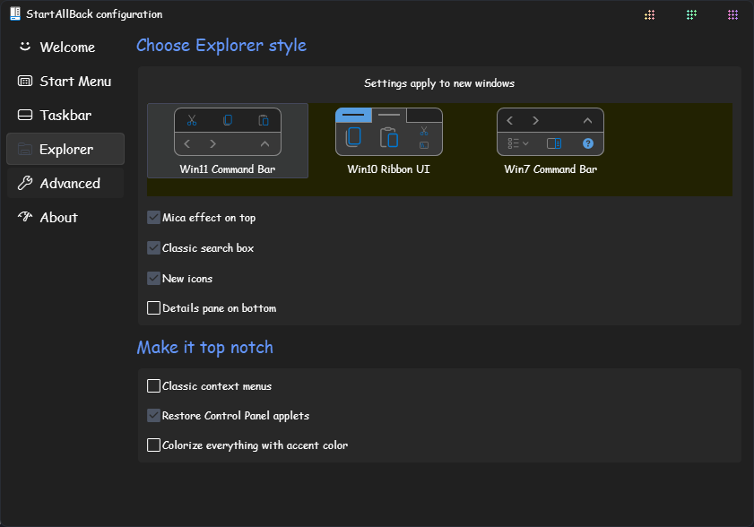

Hello visitors, it seems I have not written on this blog for a long time. Oh yes, you must know or have used a theme on your OS, and surely you are wondering "Can this theme still be applied to the highest OS version, especially Win11?"

The answer is, of course you can. So, last night I did an experiment using the "Arknights" and "Golden Marriage" themes made by ~Theia and it still worked.

# How's Apply #

The way to apply this theme is actually the same, but this time don't apply it through the default Windows settings, because later the image won't appear/fails. Apply via the Themes folder, by going to C:\Windows\Resources\Themes then searching for "Arknight Windows 10 Theme.theme, then double-clicking and waiting a moment.

# Cons #

Context menu on file explorer or desktop does not appear (classics context menu), because it is not compatible with os w11. So you can use the context menu on the latest version of the OS.

# How to Settings? #
Set on startallback like this.

# Patch for Themes #
For the patch to stay the same, don't forget to create a restore point, that's the most important.
That's it, for this post.

This tutorial also alvailable on Indonesian Version
