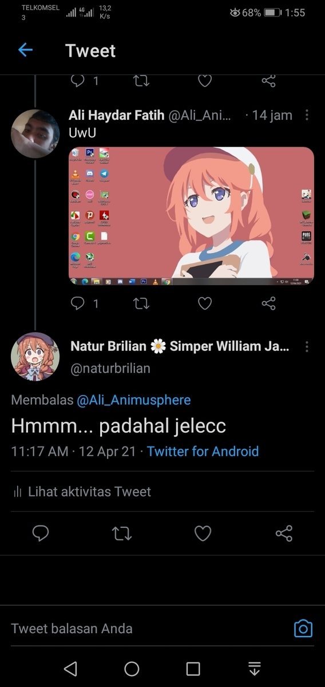

Hi, hello I'm back * sleepy expression, I think I haven't updated the posts here for a long time. Oh, yes before that I apologize, because I am also managing the blog for the Indonesian version, well, instead I have a little tutorial here, even though the video is a long duration.

ou can see the tutorial via the following link: https://youtu.be/Mjbc3DS50SQ
Actually I want to stop making the background vector background a trivial matter

Now, I don't know ... it needs to be continued or it will stop here, considering the many handsome characters, one of them is:
