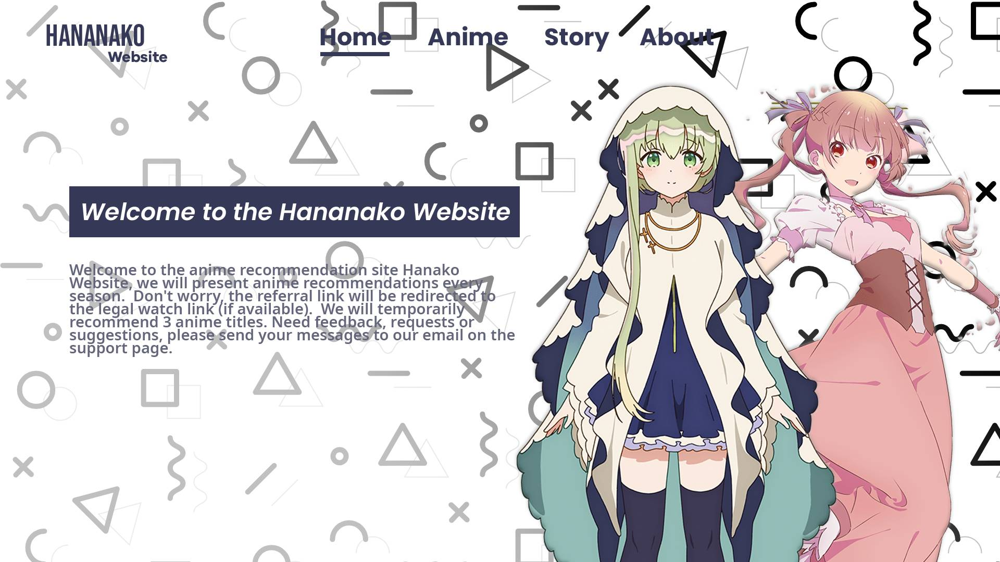
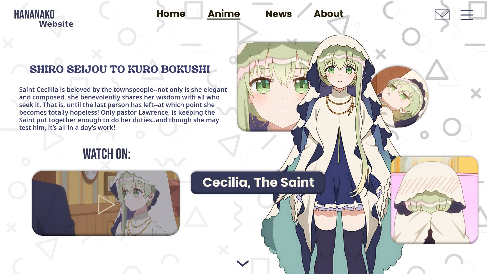
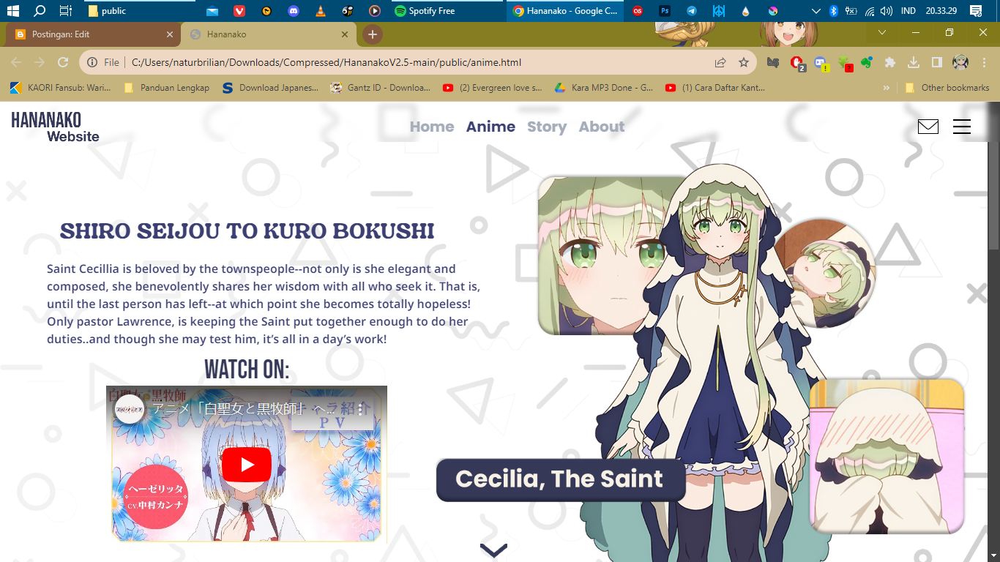
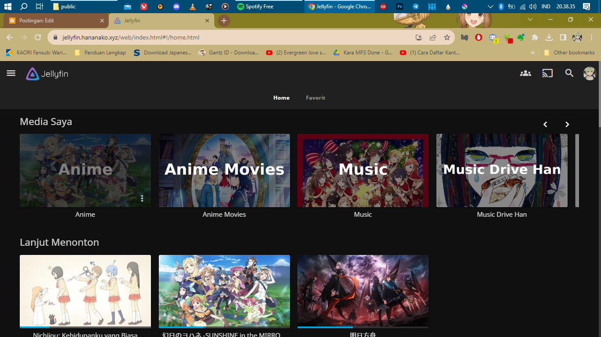
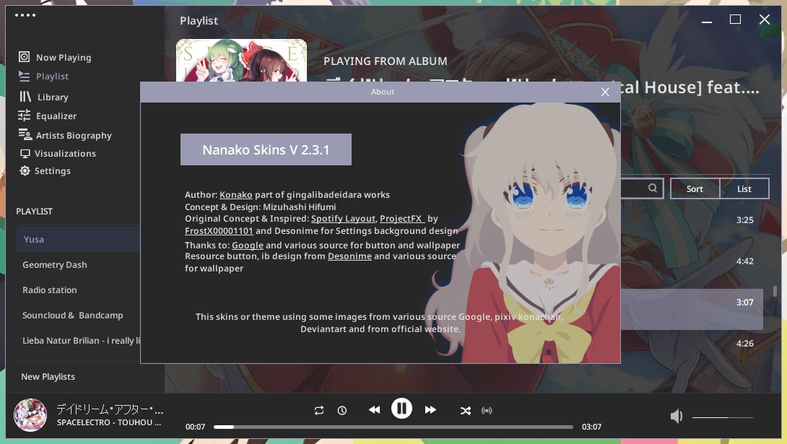
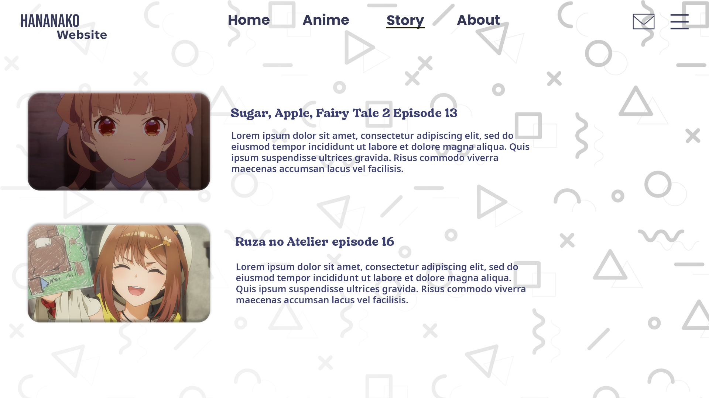
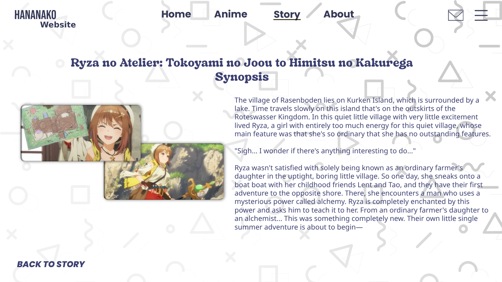

Halo, akhirnya bisa menulis kembali disini. Setelah selesai dengan urusan konsep desain untuk Nanako Music Player, akhirnya saya kembali membuat desain tentang situs web dan kali ini berkolaborasi dengan Axionite dan Kuronekosan sebagai programmer dan pengaplikasian ke situs web.

## TENTANG HANANAKO WEBSITE
Sebenarnya apa sih itu Hananako Website? Hananako Website sebuah website yang merekomendasikan kamu tentang anime yang tayang tiap musimnya dan akan diperbarui kalau sudah berganti musim, oh ya untuk anime ini kami sementara merekomendasikan 3 judul terlebih dahulu.

## Soal Tautan atau Pranala nanti merujuk kemana?
Jangan khawatir soal ini, kami akan mengarahkan ke web tonton kesayangan anda jika tersedia. Bagaimana kalau tidak tersedia? Mungkin kami akan mengarahkan ke tautan trailer atau cuplikan, dan kamu bisa menonton di tempat lain (karena saya tidak akan mempromosikan fansub dan lain sebagainya)

Penasaran untuk tampilan lainnya, proyek ini masih dalam pengembangan yang tidak bisa ditentukan untuk tanggal selesainya, karena satu, website harus menyesuaikan dengan tampilan layar perangkat dan perlu optimalisasi.

## Kenapa terpikirkan nama Hananako?
Hananako adalah nama gabungan dari Han, dan Nanako (nama nick partner saya) yang awalnya dibuat proyek untuk domain hananako yang disambungkan ke Jellyfin dan Proyek konsepan Nanako Skins.

Oh, ya untuk sekarang mungkin bisa dibilang tahap finishing di halaman Story, feedback dan About, dan ini salah satu pratinjaunya.

Sayangnya project ini sudah tidak terealisasikan karena beberapa alasan, dan hanya berupa gambar saja alias konsep.