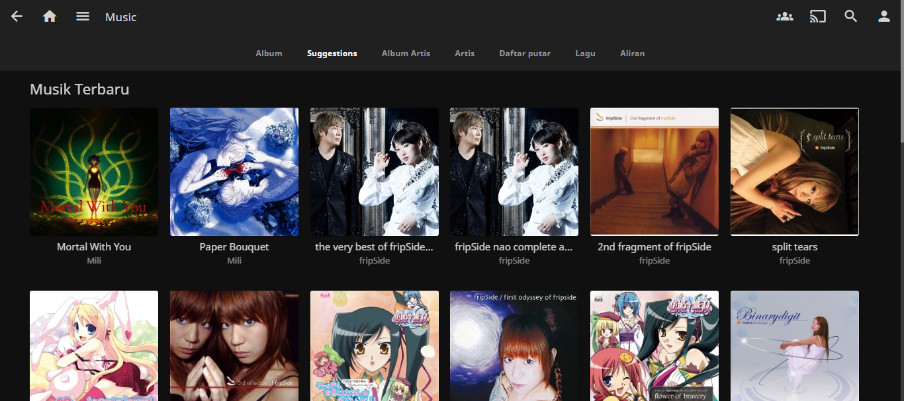
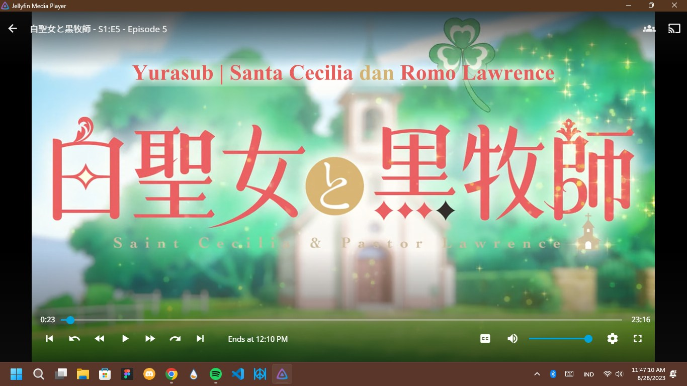

Mumpung ada kesempatan untuk nulis lagi di blog pribadi, kali ini aku ingin review Media Server yaitu Jellyfin yang aku gunakan selama 2 bulan terakhir ini. Yak awalnya ini aku benar-benar gak tertarik, pertama lihat ini hanya gara-gara postingan temanku di Facebook, lalu kemudian aku diracunin oleh pololer (salah satu staff Yurasub).

## Apa itu Jellyfin?
Seperti namanya, Jellyfin adalah server media sumber terbuka dan gratis dan rangkaian aplikasi multimedia yang dirancang untuk mengatur, mengelola, dan berbagi file media digital ke perangkat jaringan

## Soal pengelolaan Media
Kalau soal pengelolaan media, menurutku ini sangat bagus.. tetapi untuk penataan pada pustaka ini sangat-sangatlah mirip dengan Kodi, yang dimana kalau untuk lagu, kita harus mengurutkannya dengan Artist kemudian Folder Album baru trek2 dengan secara urut dan menurutku ini sangat-sangatlah enak dan mudah, biasanya aku ini build database musik pakai media player lokalan AIMP.

## Pemutaran Video
Kalau soal pemutaran video, sangatlah lancar tetapi ada minusnya, kalau video yang berdurasi lebih 1 jam atau tipe film, ini akan force close dan ane gak tau cara mengatasinya bagaimana. Nah, untuk di hp, kamu bisa mengakalinnya dengan menggunakan VLC Media player. Jadi kurasa masih kurang enak & lebih baik nonton secara luring saja.

## Untuk sumber berkas dan lain-lainnya?
Nah, untuk sumber berkasnya, ini mengandalkan Google Drive & Mega, yang disambungkan menggunakan RClone, kalau jika di host di PC atau laptop.. langsung lewat File Explorernya (Hardisk) atau biasanya kita menyebutnya Home Server.

## Format yang didukung untuk sumber ini
Format file yang didukung untuk sumber ini, tak lain *.WAV, *.MP3, *.M4A, *.FLAC, tapi jika dihosting secara daring, saya saranin sih format MP3, agar tidak menguras kuota kamu saat streaming.

## Kekurangannya menggunakan ini dibanding menggunakan pemutar media Lokal
Selama aku menggunakan ini, sering mendapati bug/error yang dimana kadang file musik yang ingin di play tidak bisa.. yang dimana kamu harus menghubungi pemilik server ini untuk memulai ulang server ini (jika kamu tidak memiliki aksesnya) agar berfungsi kembali seperti sedia kala. Lalu untuk video seperti w sebutkan tadi, kadang suka lama untuk memuat salah satu takarir, kedua force close di video berdurasi 1 jam. Tetapi sisanya normal kok.

# Sumber #
1. [Yurasub Jellyfin](https://we.yurasu.xyz/jellyfin)
2. [Hananako Jellyfin](https://jellyfin.hananako.xyz/)