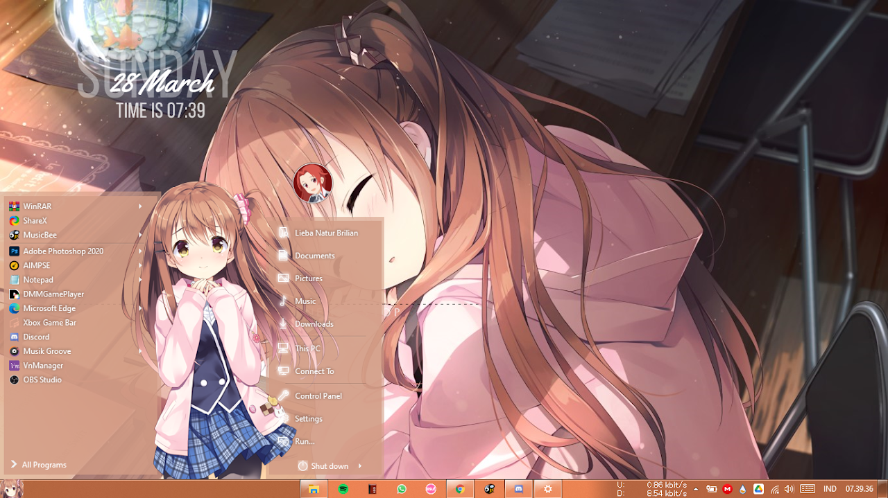
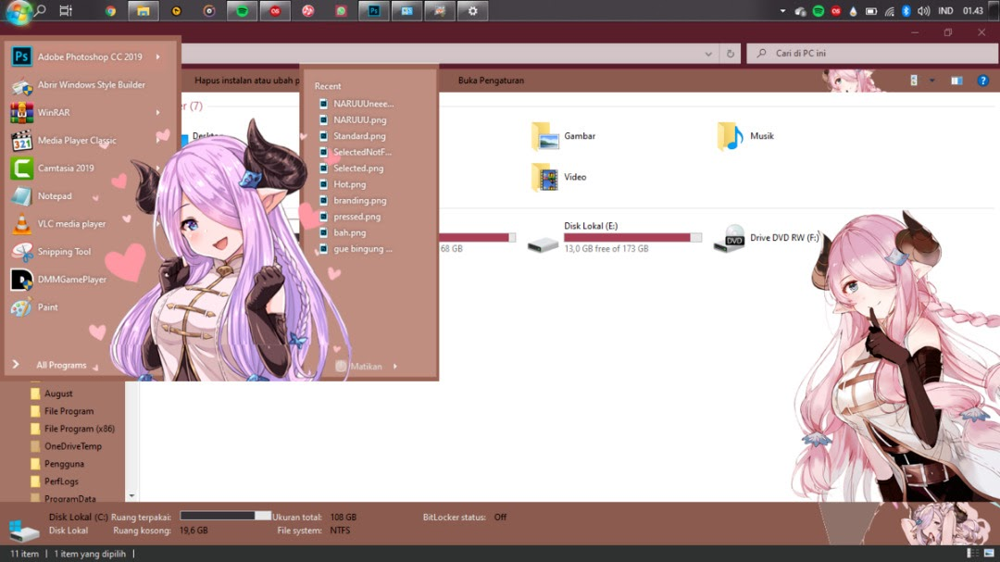
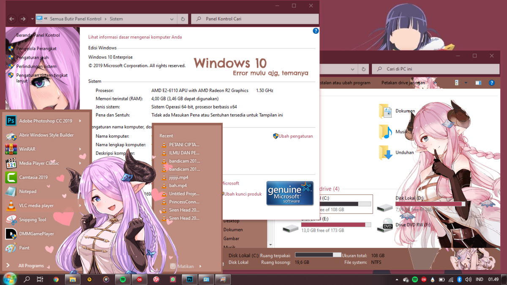

Siapa sih yang tidak kenal dengan sosok perempuan yang biasanya dibilang "Maji Tenshi"? ya sebut saja Himeno Sena dari Visual Novel Koi kakeru x shin ai kanojo.

Yaps, ini adalah salah satu pratinjau tema windows yang dibuat oleh orang yang sama, sebuah alasan mengapa dia disebut "Maji Tenshi" disebuah grup Facebook "Visual Novel Lovers". Tetapi, disini saya tidak sedang membahas tema buatannya mereka, jadi beberapa bulan lalu saya mencoba bereksperimen untuk membuat tema dengan tema dari salah satu gim browser Granblue Fantasy. 

Tangkapan layar di atas adalah salah satu pratinjau nya, perlu diketahui anda harus paham tentang soal disen dan menggunakan Photoshop/Corel Draw ditambah paham untuk menggunakan Windows Style Builder. Dan, ini adalah salah satu pratinjau untuk base panel kontrol dan penjelajah berkasnya, oh ya ini saya merubah tema dari tema Cafe Stella tetapi proyek ini tidak lanjut, karena sempat mengalami blank screen yang berujung tidak bisa masuk ke sistem windowsnya (jadi emang harus nanggung resiko, beda lagi dengan tema aplikasi/software yang bermasalah di software tinggal hapus pemasangan)

Untuk yang ingin tema Himeno Sena-nya, silahkan aja di unduh melalui tautan [berikut ini](https://www.deviantart.com/desonime/art/Himeno-Sena-Windows-10-Theme-834685295 ), oh ya saya juga membuat tema untuk browser langsung di cek aja..

Perlu diketahui, penulis tidak akan me-reupload karya orang lain, jadi penulis akan memberikan tautan aslinya.

