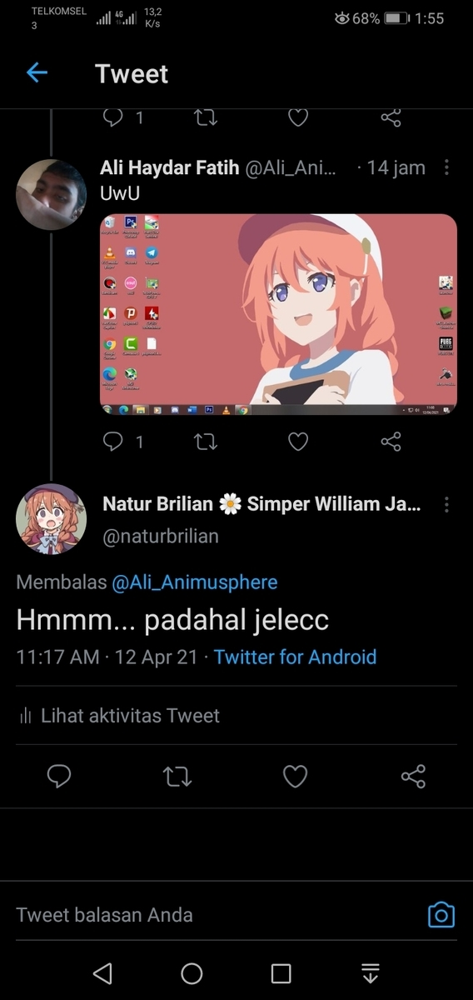
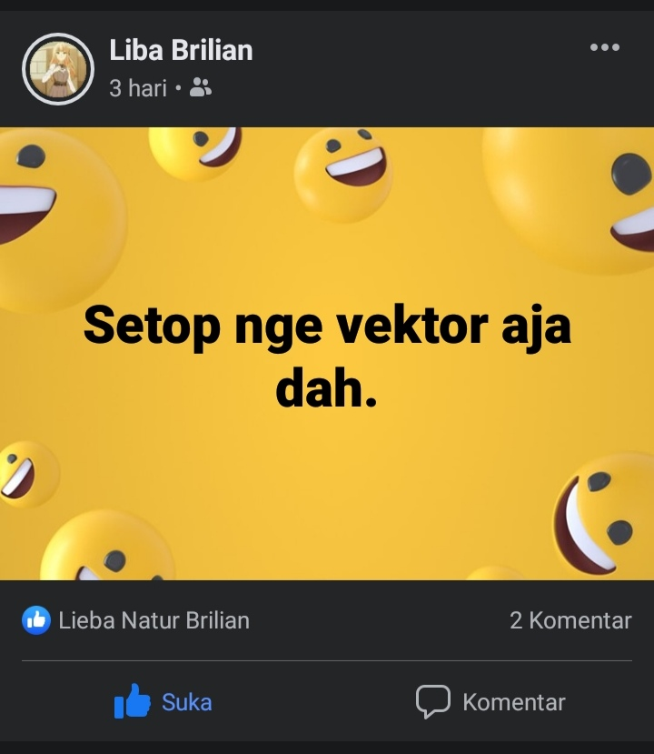

Halo, aku kembali, aku pikir sepertinya saya sudah tidak memperbaharui blog ini untuk kesekian lamanya. Oh ya untuk sebelumnya saya minta maaf, karena saya pun juga mengelola blog untuk versi Bahasa Indonesia. Dan disamping itu saya juga membuat tutorial, namun sayangnya video itu versi panjang.
Kamu bisa melihat tutorial pembuatan vektor ini melalui tautan berikut, atau

<iframe width="100%" height="468" src="https://www.youtube.com/embed/Mjbc3DS50SQ?si=NDSglW_BUgT2LIiT" title="YouTube video player" frameborder="0" allowfullscreen></iframe>

Sebelum aku ingin menghentikan aktivitas pembuatan vektor karena sebuah alasan yang sangat konyol, mungkin beberapa pembaca masih ingat soal cuitan tweet ini yang membuat saya waktu itu ingin berhenti membuat vektor.

Nah, pada kenyataannya proyek ini masih dilanjut, namun aku sendiri juga jarang membuat desain style seperti ini & sekarang lebih fokus ke proyek terjemahan dikala senggang.

Sebenarnya saya tidak ingin pensi, namun mungkin lebih tepatnya sudah memasuki masa-masa sudah bosan membuat seperti ini ehek~