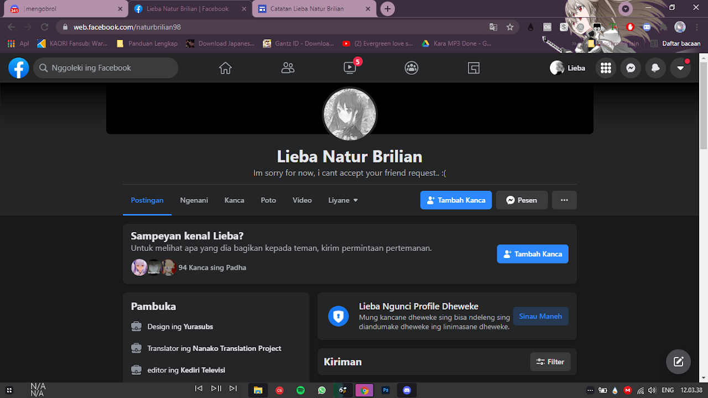
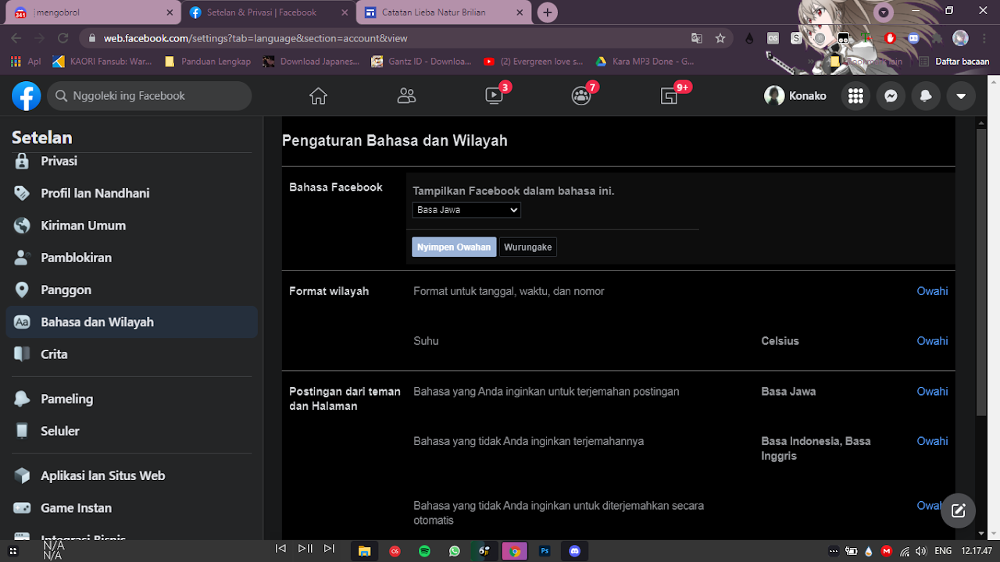
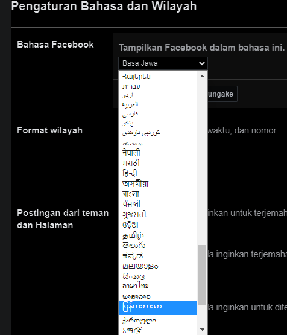
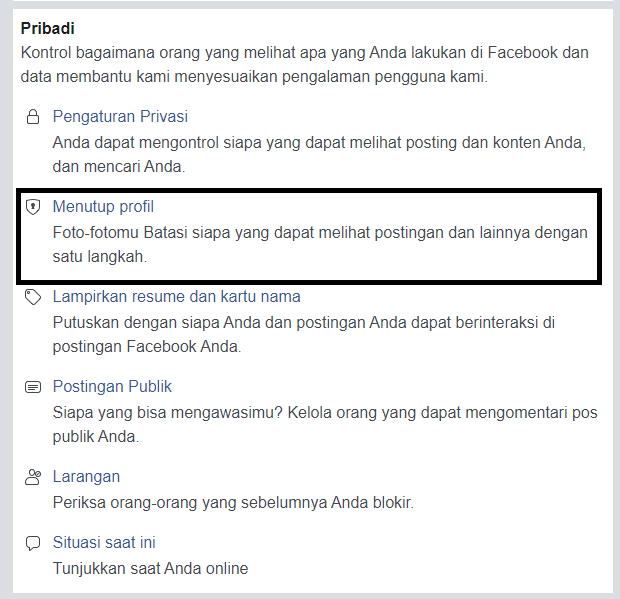

> [!NOTE]
> Facebook versi saat ini sudah bisa menggunakan fitur ini tanpa harus mengubah bahasa tampilan.

Halo, rasanya saya sudah lama tidak menulis artikel lagi di blog pribadi ini, dikarenakan saya sendiri yang lagi keasyikan main gim Princess Connect Re:Dive & sibuk di rl. Jadi saya menyempatkan kembali untuk menulis artikel tentang tutorial, jadi kemarin di salah satu peladen Discord bernama Yurasubs server ada salah satu admin bertanya kepada saya, bagaimana cara mengunci akun Facebook seperti ini

Jadi sebelumnya saya sudah membuat tutorial nya, tetapi sayangnya video tutorial tersebut tidak saya unggah di akun biasanya, melainkan di akun real life, karena saya yakin kalian mengerti kan, tutorial sebelumnya sudah dibagikan oleh salah satu pengguna akun Facebook hanya saja postingannya tenggelam, mari kita mulai langkah2 nya, oke.

## Masuk ke akunmu
Pastikan akun yang anda gunakan sebelumnya belum pernah di kunci, langkah awal kita masuk ke bagian pengaturan, kemudian kamu pergi ke tab Bahasa, ini paling penting (dikarenakan penulis saat ini bahasa tampilan nya menggunakan Bahasa Jawa)

## Bahasa
Tentu saja untuk fitur ini kamu harus mengganti Bahasa ke Burma/Myanmar, karena pengaturan atau fitur ini tidak tersedia jika kamu menggunakan Bahasa Indonesia ataupun Jawa, let's change interface your account. Nanti setelah terganti jangan lupa aktifkan Google Translate agar mudah.

## Ubah tampilan ke mbasic kalau masih bingung
Jika kamu bingung mencari pengaturan "profil terkunci" kamu bisa merubah tampilan Facebook ke mbasic, cukup ketik di bilah browser seperti biasa, lalu pergi ke pengaturan > skrol ke bawah (bagian Pribadi) sampai terlihat gambar kunci seperti ini (gambar disamping/atas), lalu tekan "tutup profil anda"
## Selesai
Jika sudah, tampilannya akan jadi seperti ini, berarti berhasil. Jangan lupa ganti kembali bahasa tampilannya ke Bahasa favorit Anda. ̶S̶e̶b̶e̶n̶a̶r̶n̶y̶a̶ ̶c̶a̶r̶a̶ ̶i̶n̶i̶ ̶s̶a̶n̶g̶a̶t̶l̶a̶h̶ ̶m̶u̶d̶a̶h̶,̶ ̶h̶a̶n̶y̶a̶ ̶s̶a̶j̶a̶ ̶k̶a̶d̶a̶n̶g̶ ̶k̶a̶d̶a̶n̶g̶ ̶o̶r̶a̶n̶g̶ ̶m̶a̶l̶a̶s̶ ̶u̶n̶t̶u̶k̶ ̶m̶e̶m̶p̶r̶a̶k̶t̶i̶k̶k̶a̶n̶n̶y̶a̶,̶ ̶d̶a̶n̶ ̶m̶a̶s̶i̶h̶ ̶a̶d̶a̶ ̶y̶a̶n̶g̶ ̶b̶e̶r̶t̶a̶n̶y̶a̶,̶ ̶b̶a̶g̶a̶i̶m̶a̶n̶a̶ ̶c̶a̶r̶a̶n̶y̶a̶ ̶m̶e̶n̶g̶u̶n̶c̶i̶ ̶a̶k̶u̶n̶ ̶d̶a̶n̶ ̶s̶e̶b̶a̶g̶a̶i̶n̶y̶a̶.̶ Untuk pengguna Lite setelah anda merubah bahasa tampilannya, tinggal masuk bagian pengaturan dan lakukan cara yang sama (karena tampilan pengaturan menggunakan mbasic)
## Video Tutorial
Jadi selain saya memberikan tutorial versi tertulis, saya juga membuat versi video, dan sudah saya buat/rekam beberapa bulan yang lalu.
[Lihat Disini](https://drive.google.com/file/d/1NqKh_aTyylqEmAmHc0yE2iurH7N5uZfM/view)

Sekian untuk tutorial dan artikel gabut yang saya tulis, saya disini hanya menulis ulang saja, karena postingan aslinya sudah tenggelam, dan lupa nama akun Facebook yang buat tips nya.

# Catatan Tambahan
Untuk saat ini tutorial ini tidak bisa kamu praktikkan dikarenakan ada perubahan pada pengaturan konfigurasi di Facebook itu sendiri, nanti saya usahakan buatkan tutorial jika sudah ketemu caranya. Sekian dari saya.
