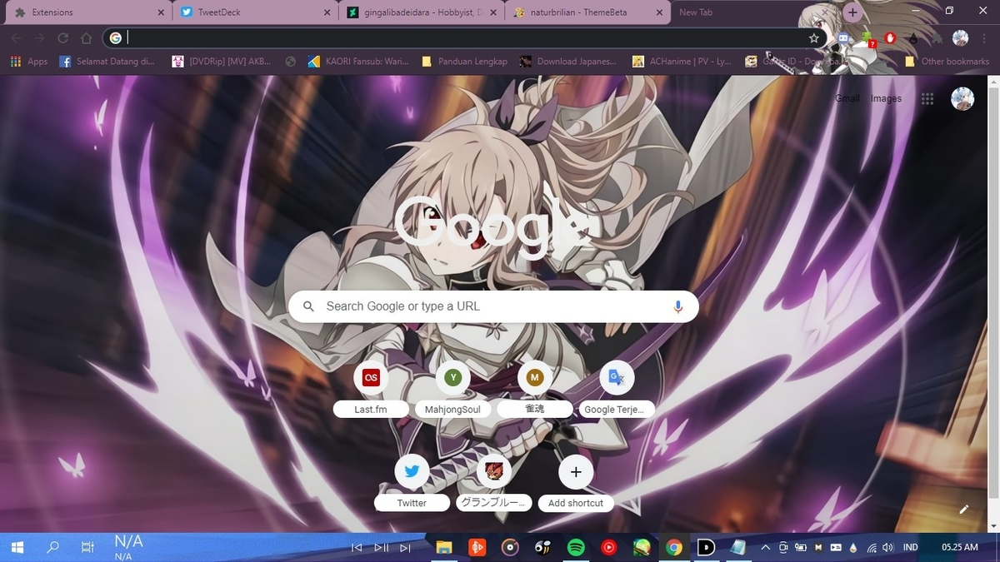
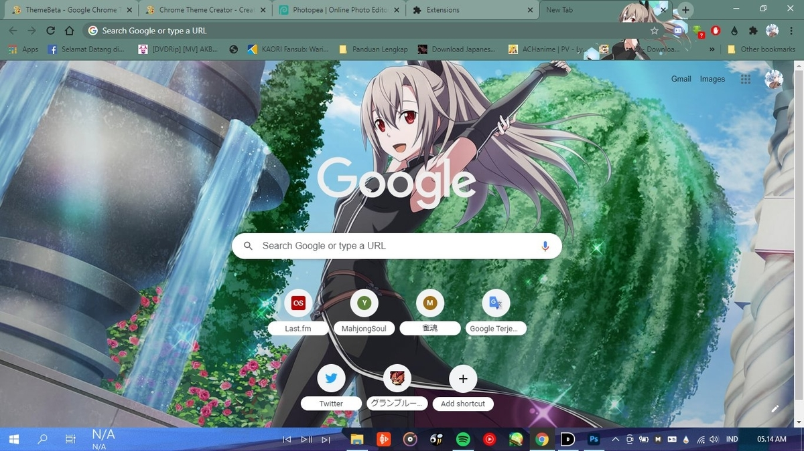

Maybe, like the title in this particular article, what do you expect in 2021, many people hope that someone wants a new device for editing purposes, wants a soul mate and so on. Oh, yes, just like the author of the article on this blog & I also hope that in the next year no problems will happen to me, such as stupid account hacking events and so on.

Btw, this is also the last article for 2020, as well as a bonus, yesterday I also had the chance to create another theme, from one of the mobile games none other than from Sword Art Online Alicization with character Eydis Synthesis.

You can download it via this repo.

::github{repo="naturbrilian/Chrome-Themes"}

Thank you for visiting my blog, and i say Happy New Year 2021, I hope your wishes are fulfilled, and I look forward to seeing Yuanfen debut in the new year.